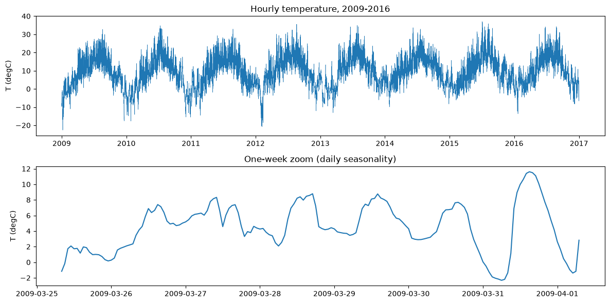
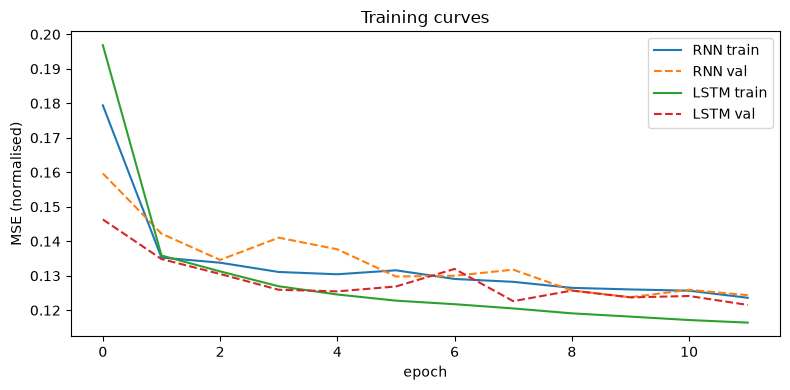
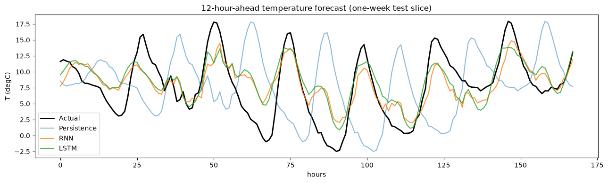
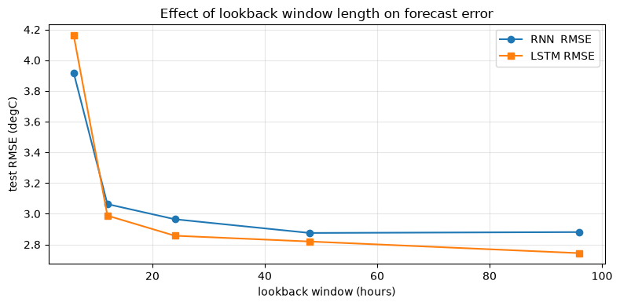
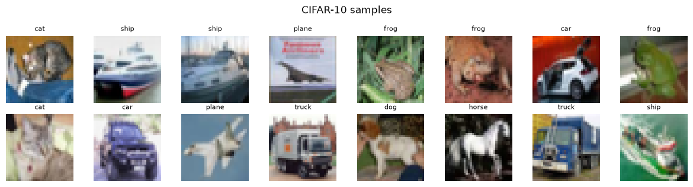
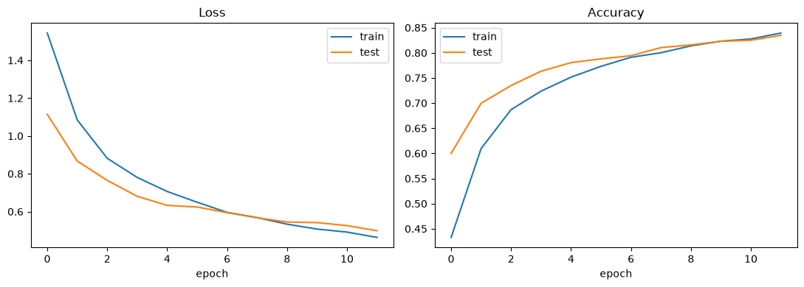
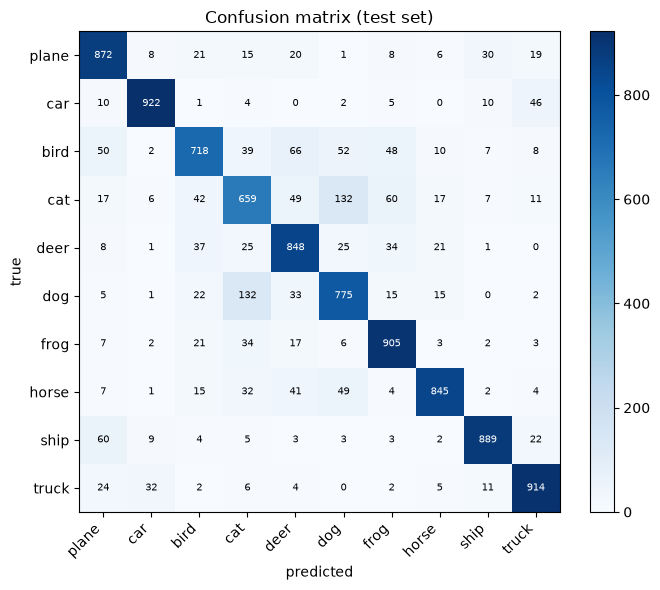
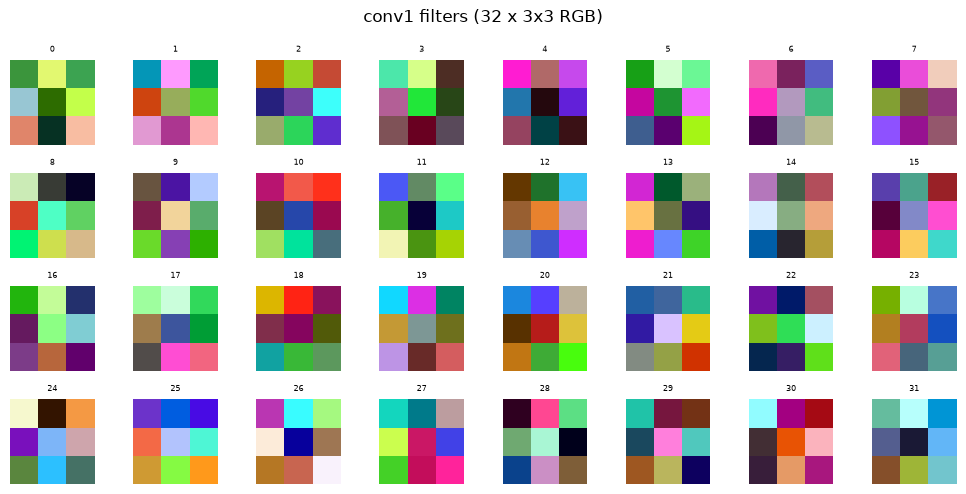
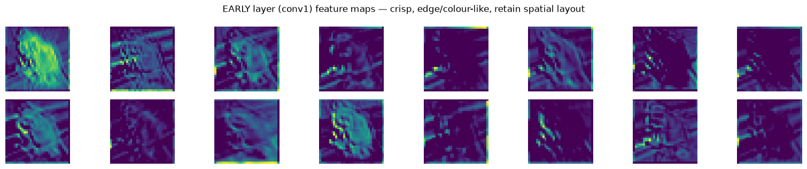

# Deep Learning I — Final Project Report

**Course:** Deep Learning I: Neural Networks (Semester 4) · Section A · Group 1

**Group members (8):** Shreyansh Arora (24BCS10252), Bhavya Patel (24BCS10420),
Rudra Longaonkar (24BCS10312), Mohammed Rehan (24BCS10620), Avishkar Chavan (24BCS10065),
Milap Kothari (24BCS10004), Soham Ambore (24BCS10258), Shubh Shukla (24BCS10093).

---

## Abstract
We present two studies. **Task 1 (applied)** forecasts air temperature **12 hours ahead**
from the Jena Climate dataset, comparing a moving-average/persistence baseline, a vanilla
RNN, and an LSTM, and analysing the effect of the lookback-window length. **Task 2
(experimental)** trains a small VGG-style CNN on CIFAR-10 (82.2% test accuracy) and
visualises its first-layer filters and feature maps at an early vs. a late layer to show how
representations grow more abstract with depth.

---

## Task 1 — Time Series Forecasting (Weather)

### 1.1 Problem & data
Predict the temperature (`T (degC)`) **12 hours ahead** from the Jena Climate dataset
(2009–2016, 10-min readings resampled to hourly → ~70k points; ~49k supervised windows).
Strong daily seasonality is visible in the one-week zoom (Fig. 1). Data is split
**chronologically** 70/15/15 and standardised using **train** statistics only (no leakage).
Inputs are sliding windows of `LOOKBACK` hours → the value 12 h after the window.

*Fig. 1 — Full hourly series (2009–2016) and a one-week zoom showing the daily cycle.*

### 1.2 Methods
- **Baseline** — persistence (forecast = last observed value) and moving average of the
  window. No training.
- **Vanilla RNN** — `nn.RNN`, hidden=64, last hidden state → linear head.
- **LSTM** — `nn.LSTM`, hidden=64, same head. Identical training (Adam, MSE, 12 epochs) so
  the only difference is the recurrent cell.
All metrics (MAE, RMSE) are reported in **°C** after de-normalisation.

### 1.3 Results

| Model | MAE (°C) | RMSE (°C) |
|---|---|---|
| **LSTM** | **2.19** | **2.81** |
| Vanilla RNN | 2.22 | 2.86 |
| Moving average | 2.96 | 3.73 |
| Persistence | 4.18 | 5.41 |

The **LSTM is best**, cutting RMSE by **~48%** versus the persistence baseline (2.81 vs 5.41).
At a 12-hour horizon persistence is badly out of phase — it predicts the temperature from
12 h earlier, i.e. roughly the opposite point of the day/night cycle (Fig. 3, light blue),
which is exactly why the recurrent models win so clearly here.

*Fig. 2 — Training/validation MSE (normalised). Both converge; the LSTM reaches a lower val loss.*

*Fig. 3 — 12-h-ahead forecast over a one-week test slice. RNN/LSTM track the daily cycle;
persistence is a full half-day out of phase.*

### 1.4 Ablation — lookback window length
We retrain RNN and LSTM for lookbacks `[6, 12, 24, 48, 96]` h (Fig. 4).

| Lookback (h) | RNN RMSE | LSTM RMSE |
|---|---|---|
| 6 | 3.92 | 4.16 |
| 12 | 3.06 | 2.99 |
| 24 | 2.96 | 2.86 |
| 48 | 2.88 | 2.82 |
| 96 | 2.88 | **2.74** |

*Fig. 4 — Test RMSE vs lookback window length.*

**Analysis.** A 6-hour window is **too short** — it can't see the daily cycle, and error is
worst (≈3.9–4.2 °C). Error drops sharply as the window approaches ~24 h (one full day), then
**flattens**. Beyond that the two cells diverge: the **LSTM keeps improving** out to 96 h
(2.82 → 2.74) because its gates retain useful long-range context, whereas the **vanilla RNN
plateaus and slightly worsens** (2.875 → 2.881), consistent with its weaker long-sequence
memory. Practical takeaway: ~24–48 h is the sweet spot for the RNN; the LSTM benefits from
longer windows.

---

## Task 2 — CNN Filter Visualization (CIFAR-10)

### 2.1 Problem & model
Train a 4-conv VGG-style CNN (conv1 32 → conv2 64 → conv3 128 → conv4 128, two max-pools,
FC head; **2,340,810 params**) on CIFAR-10 with light augmentation (random crop + flip) and
channel normalisation.

*Fig. 5 — Sample CIFAR-10 images.*

### 2.2 Results
**Final test accuracy: 82.2%** (12 epochs). Curves are healthy with a small train/test gap.

*Fig. 6 — Training/test loss and accuracy.*

*Fig. 7 — Test-set confusion matrix.*

Per-class accuracy is highest for visually distinct classes (ship 92%, plane 90%, truck 89%,
deer 87%) and lowest for visually similar animals (**cat 61%**, **bird 70%**, dog 75%). Most
errors fall between semantically close classes — notably **cat↔dog** (128 + 92 misclassified)
and **car↔truck** (77) — which is the expected CIFAR-10 failure mode.

### 2.3 Filter & feature-map visualization

*Fig. 8 — The 32 first-layer (conv1) filters: low-level edge / colour-opponent detectors.*

*Fig. 9 — Feature maps for one input. **Early (conv1, 32×32)** are sharp and retain the
object outline; **late (conv4, 16×16)** are coarse, sparse, and abstract.*

### 2.4 Analysis — abstraction with depth
The network builds a hierarchy: pixels → edges/colours (conv1) → textures/parts → abstract,
class-discriminative features (conv4). Early maps answer *where* (spatial detail); deep maps
answer *what* (semantics), trading resolution for meaning. Many conv4 channels are silent for
a given image (sparse, selective activations) — a hallmark of learned high-level detectors.
This hierarchy is *why* deep stacks of small convolutions classify well, and it is consistent
with the confusion-matrix errors clustering among visually similar classes.

---

## Conclusion
For 12-h-ahead temperature forecasting, **LSTM > RNN ≫ moving average ≫ persistence**, and the
lookback sweep shows error falling until ~one daily period then flattening, with the LSTM
uniquely benefiting from longer context. The CNN study makes the depth→abstraction story
concrete and visual at 82.2% accuracy. **Limitations / future work:** multi-step (sequence)
forecasting and exogenous features (pressure, humidity) for Task 1; deeper nets / Grad-CAM for
Task 2.

## Member contributions
| Member | Roll No | Email | Contribution |
|---|---|---|---|
| Shreyansh Arora | 24BCS10252 | shreyansh.24bcs10252@sst.scaler.com | Project coordination; Task 1 data pipeline & preprocessing |
| Bhavya Patel | 24BCS10420 | bhavya.24bcs10420@sst.scaler.com | Task 1 RNN/LSTM model implementation & training |
| Rudra Longaonkar | 24BCS10312 | rudra.24bcs10312@sst.scaler.com | Task 1 lookback-window ablation & forecast analysis |
| Mohammed Rehan | 24BCS10620 | mohammed.24bcs10620@sst.scaler.com | Task 1 baselines, metrics (MAE/RMSE) & evaluation |
| Avishkar Chavan | 24BCS10065 | avishkar.24bcs10065@sst.scaler.com | Task 2 CNN architecture & training |
| Milap Kothari | 24BCS10004 | milap.24bcs10004@sst.scaler.com | Task 2 evaluation: confusion matrix & training curves |
| Soham Ambore | 24BCS10258 | soham.24bcs10258@sst.scaler.com | Task 2 filter & feature-map visualization |
| Shubh Shukla | 24BCS10093 | shubh.24bcs10093@sst.scaler.com | Report writing & slide deck preparation |

> _Note: every member ran both notebooks end-to-end and can explain any part for the viva._

## References
- Jena Climate dataset (Max Planck Institute for Biogeochemistry).
- Krizhevsky, *Learning Multiple Layers of Features from Tiny Images* (CIFAR-10), 2009.
- Hochreiter & Schmidhuber, *Long Short-Term Memory*, Neural Computation, 1997.
